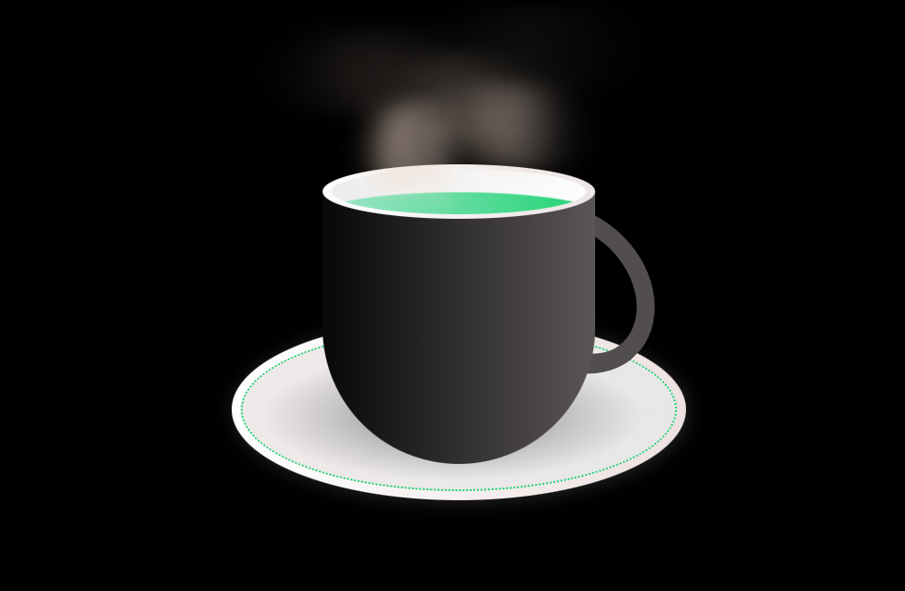

# 🍵 Green Tea Cup

A beautiful, animated **steaming cup of green tea** created purely with **HTML & CSS**.  
This mini-project demonstrates **CSS animations, gradients, and glassmorphism-inspired effects**.

---

## 🔹 Features
- Realistic green tea color with smooth gradient
- Animated steam rising from the cup
- Stylish cup handle and plate design
- Fully responsive and lightweight
- No JavaScript required

---

## 💻 Tech Stack
- HTML5
- CSS3 (Flexbox, Animations, Gradients)

---

## 📸 Screenshot


---

## 🚀 How to Use
1. Clone the repository:
```bash
git clone https://github.com/Kiumars609/green-tea-cup.git
